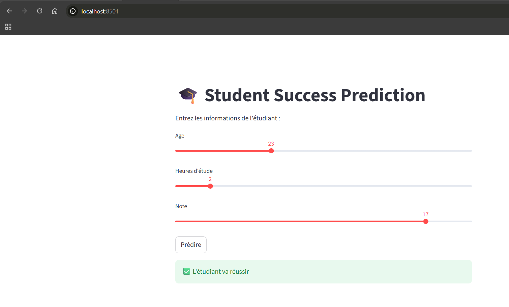
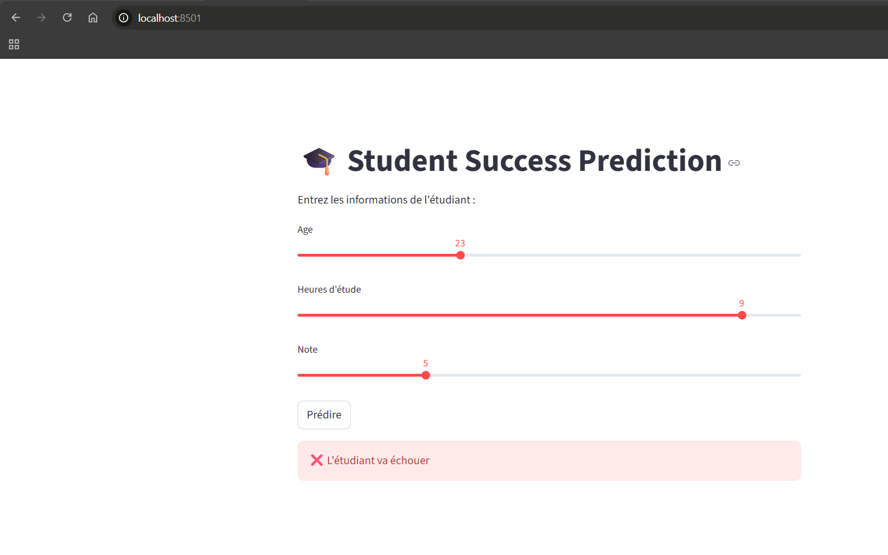

# 🎓 Student Success Prediction App

This project is a Machine Learning web application built with Streamlit.

##  Features
- Predict student success (pass/fail)
- Simple and interactive interface
- Real-time prediction

##  Technologies
- Python
- Scikit-learn
- Streamlit
- Pandas

## ▶️ Run the app

```bash
streamlit run app.py

## 🖼️ Application Preview

### ✅ Réussite


### ❌ Échec



